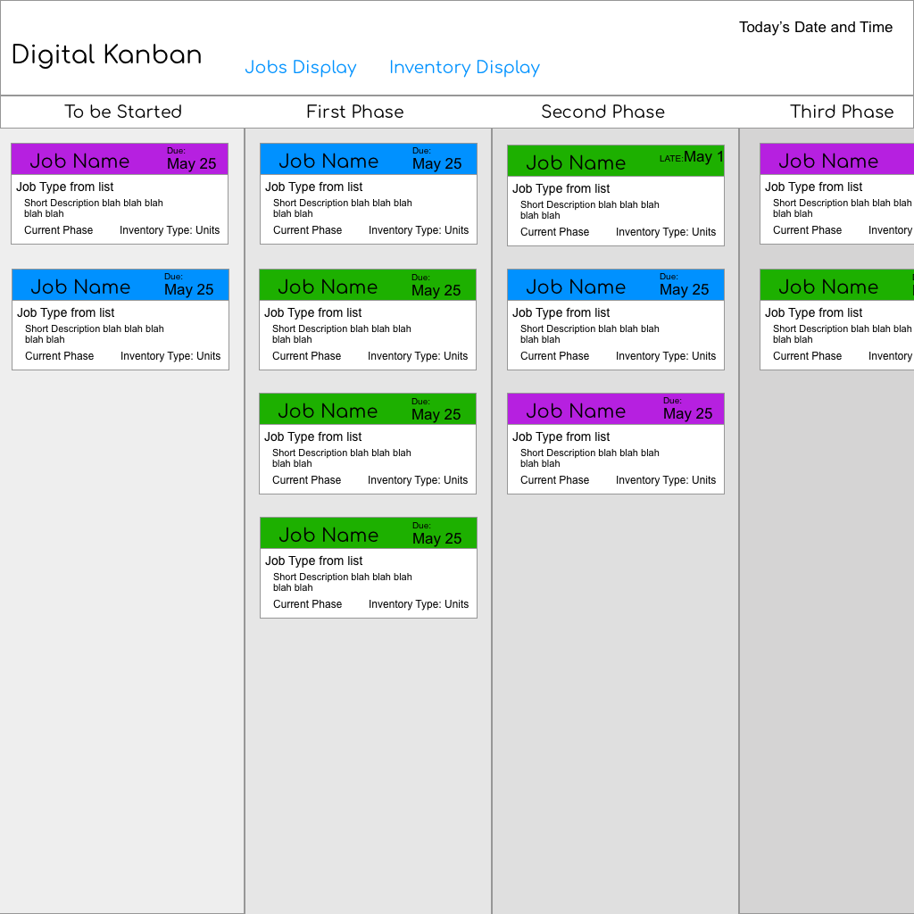
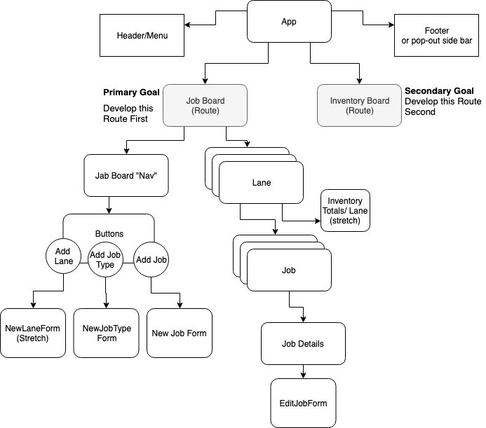

# Digital Kanban PLANNING REPO

#### Job and Inventory Tracking for Your Business

_Authors_  **Kim McConnell**

1. [Project Proposal](#project-proposal)
1. [Target Audience/Users](#target-audience/users)
1. [User Stories](#user-stories)
1. [Product Requirements](#product-requirements)
1. [Non-technical Requirements](#non-technical-requirements)
1. [Planning](#Planning)
1. [Development Specs](#development-specs)
1. [Stretch Goals](#stretch-goals)
1. [Technologies Used](#technologies-used)
1. [License](#license)

## Project Proposal
<hr/>

_This is the original proposal for the project. Some featues/technologies many change_

Project’s Purpose or Goal: 
Allow users to track jobs by setting up job "state" (i.e. In Progress, In Review, Late, etc), adding jobs, changing state of tasks, and tracking specific inventory used by the task at different states. Project uses an SQL database.

List the absolute minimum features the project requires to meet this purpose or goal: 
- User chooses from a list of specific state types to apply to board
- User can add Job types, with set inventory use per state
- User can add, modify, delete, mark complete 'instances' of jobs
- Inventory is tracked and displayed to user in separate interface
- Working database storing and supplying data

What tools, frameworks, libraries, APIs, modules and/or other resources (whatever is specific to your track, and your language) will you use to create this MVP? List them all here. Be specific.
- React
- Redux
- Database in a SQL language
    Porobably MySQL/Express with Knex or an ORM
    Possibly using GraphQL (instead of Express?) (currently researching, seams very useful, fast, and pointed)


If you finish developing the minimum viable product (MVP) with time to spare, what will you work on next? Describe these features here: Be specific.
- Host database using AWS
- Allowing user to set their own job state types
- Inventory tracking is specific to a job being in particular states, with multiple inventory possibilities for different states in the same job
- Inventory view with color indicators for stock of particular inventory
- Make the board looks nice, with textures and jobs on "post-it" style cards
- Click to expand a particular job from board, see more details about current "state"
- Jobs entering a state that requires inventory will format an inventory request to be sent to supplier 
- Possibly send off a message, via email or some other means, when inventory is used below a threshold, so that an inventory order can be placed. 

What additional tools, frameworks, libraries, APIs, or other resources will these additional features require?
- CSS libraries yet to be determined 
- AWS Aurora Serverless to host MySQL server

Is there anything else you’d like your instructor to know? 
My primary goal is MVP with all database features working as a means to learn more back-end skills. I would also really like to have a deployable app with my database by using AWS to host the database.


## Target Audience/Users
<hr/>
* Buisnesses, primarily manufacuring, that rely on inventory. 

## User Stories
<hr/>
**As a** buisness owner<br>
**I want** to see the inventory that is being used in a given time frame and place orders for more inventory frequently<br>
**So that** I can follow JIT/Lean prinicples to reduce inventory store size and reduce waste, increasing profit margins. 

**As an** employee<br>
**I want** to be able to quickly see a visual representaion of how many jobs are ongoing, which ones are behind schedule, and what inventory will be consumed by each<br>
**So that** I can effiently plan for today's tasks and ensure the inventory is there to perform those tasks. 

## Product Requirements
* Full CRUD functionality for job types, individual jobs, and inventory types
* Display jobs that have been added to the board
* Display how much inventory a job is using at a given phase
* Inventory view shows total inventory used in a given time frame. 


## Non-technical Requirements
<hr/>
* Have jobs display on a post-it like div that flips over for details page (Stretch)<br>

## Planning
<hr/>

## Component Map
#### First Draft of Basic Wireframe 



#### First Draft of Component map 


#### The Shape of "State"
Slices: 
- masterJobTypes
- masterInventoryTypes
- masterJobsList
- masterLaneTypes (stretch)
- sideBarOpen (bool)(strech)
- selectedLane
- selectedJobType
- selectedJob

Shape: 
(_note: a few differnt formats are used here at the moment, eventually one will be picked_)
````Javascript
state = {
  masterJobTypes: {
    nameOfType: {
      name: nameOfType,
      description: desciptionOfType,
      lanes: ["lane1", "lane2", "lane4"],
      inventory: {
        type: inventoryType,
        lane: "lane4"
      }
    },
    nameOfSecondType: {
      name: nameOfType,
      description: desciptionOfType,
      lanes: {
        lane1: {
          nameOfLane: "lane1",
          inventory: nameOfInventory or Null
          inventoryAmount: 10
        },
        lane3: {
          nameOfLane: "lane3",
          inventory: nameOfInventory or Null
          inventoryAmount: 10
        }
      }
    }
  },
  masterInventoryTypes: {
    nameOfType: {
      name: nameOfType,
      desciption: descriptionOfType,
      amountInStock: 1000, 
    }
  }
  masterJobsList: {
    uuid(or iterator): {
      id: uuid(or iterator),
      jobType: typefromlist,
      startDate: newDate,
      dueDate: dueDate,
      specialInstructions: "make sure this job is done first"
    }
  }
  selectedLane: keyOfLane,
  selectedJobType: keyOfJobType, 
  selectedJob: keyOfJob, 
}
````

#### Thoughts/concerns with data Structure
- How to make individual jobs editable without changing the job types themselves
- How best to structure for a sql database with minimal JOINS


### Development Specs
<hr/>
* 

## Stretch Goals
<hr/>
* 


## Technologies Used
<hr/>

### Musing and Decisions on Technologies to use
- This was always going to be a React app. 
- Original intent was to use a SQL database for data storage. 
- GraphQL was brough up as something I should look into, and I did. It's a great technology, with the primary advantage being it reduces the load on the user's data to query, since the queries are getting very specific bits of information instead of all data at a specified endpoint. This makes it faster and often more secure as well (exposing less endpoints). But how to integrate? Some options I considered: 
    - It can be used with Express with a SQL database
    - It can be used "alone" (but probably with some other techs) with _any_ database
    - It can be used with Express being hosted by Firebase Functions, since Express is basically one big function. This meathod seemed elegant and neat, and I spent some time exploring Firebase Functions (even got some to work!) before deciding that I still did not want to use Firebase's no-sql database. 
- I ultimaty decided to use MySQL with Express middleware and Knex for query building, migrations, and seeds because I have some experience with it and I know I can make that stack work. Integrating GraphQL _in addition_ to these is a strech goal, and something I'd like to play around with in the future.
- I looked into Relay, an alternative to Redux that requires React and GraphQL. An elegant solution, for sure, but I decided against it mainly because my first step would necessarily be seeting up GraphQL, which I was undecided on using anyway. If I had GraphQL experience already, I would have probably used Relay; each component is wrapped in a container which gets a specified set of data (only exactly what it needs) from GraphQL.
- I chose to start the project with create-react-app to take advantage of a fully-functional evnvironment using the latest verion of React to have the option of Hooks and other things specific to the latest version.
- I'm using the styled-components library for at least some styling.